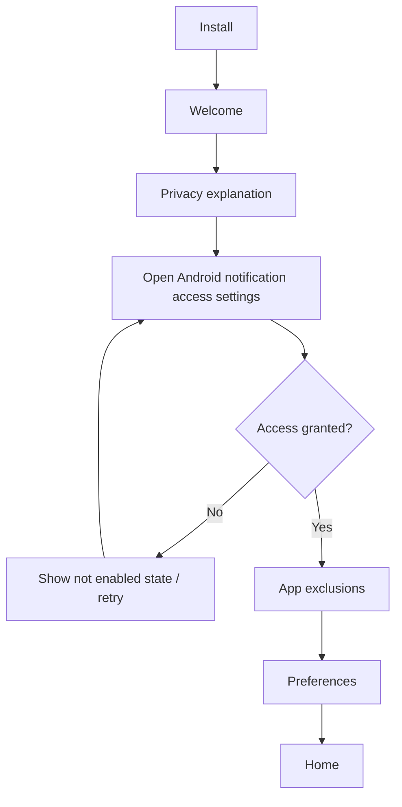
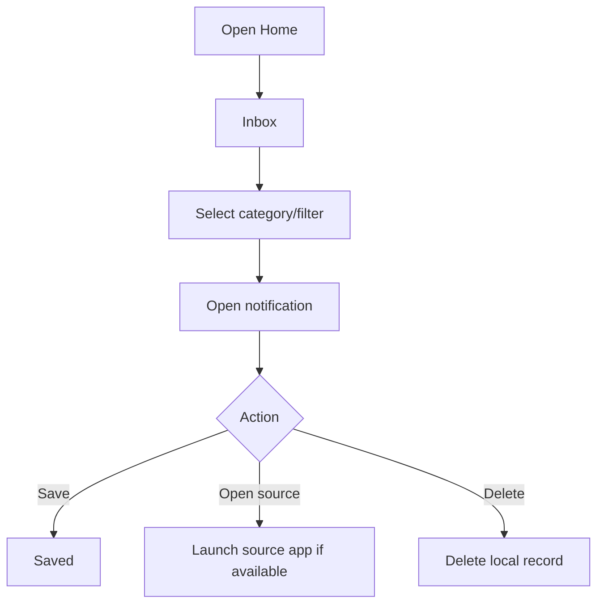
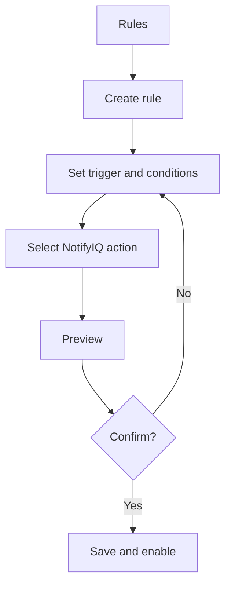
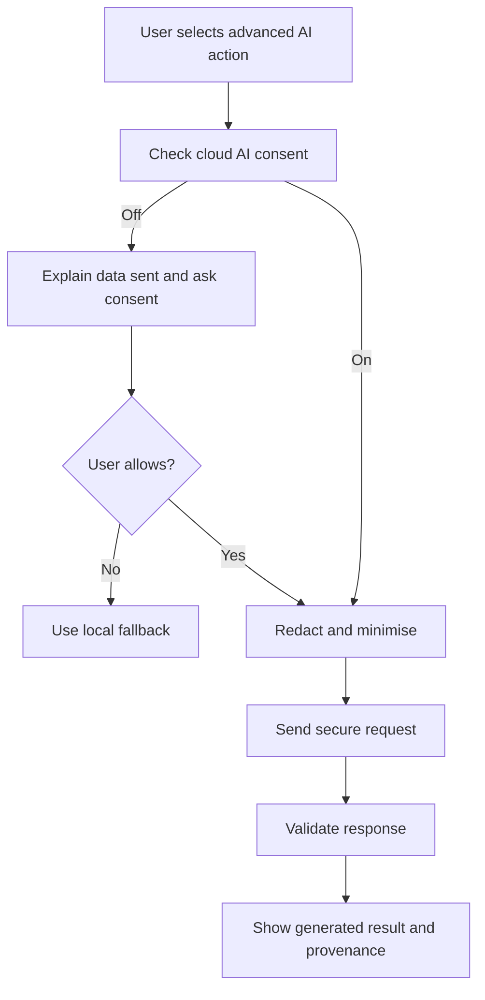

# User Flows

## First run

```mermaid
flowchart TD
 A[Install] --> B[Welcome]
 B --> C[Privacy explanation]
 C --> D[Open Android notification access settings]
 D --> E{Access granted?}
 E -->|No| F[Show not enabled state / retry]
 F --> D
 E -->|Yes| G[App exclusions]
 G --> H[Preferences]
 H --> I[Home]
```

## Notification review

```mermaid
flowchart TD
 A[Open Home] --> B[Inbox]
 B --> C[Select category/filter]
 C --> D[Open notification]
 D --> E{Action}
 E -->|Save| F[Saved]
 E -->|Open source| G[Launch source app if available]
 E -->|Delete| H[Delete local record]
```

## Rule creation

```mermaid
flowchart TD
 A[Rules] --> B[Create rule]
 B --> C[Set trigger and conditions]
 C --> D[Select NotifyIQ action]
 D --> E[Preview]
 E --> F{Confirm?}
 F -->|No| C
 F -->|Yes| G[Save and enable]
```

## Cloud AI opt-in

```mermaid
flowchart TD
 A[User selects advanced AI action] --> B[Check cloud AI consent]
 B -->|Off| C[Explain data sent and ask consent]
 C --> D{User allows?}
 D -->|No| E[Use local fallback]
 D -->|Yes| F[Redact and minimise]
 B -->|On| F
 F --> G[Send secure request]
 G --> H[Validate response]
 H --> I[Show generated result and provenance]
```
